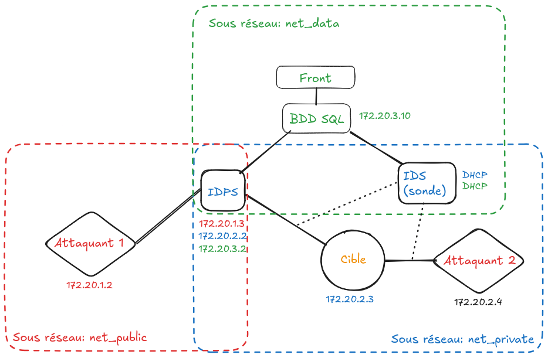

# SIDPS - Simple Intrusion Detection and Protection System

SIDPS est un outils de détection et de prévention d'intrusion.  
Il est capable de détecter & d'identifier différents types d'attaques réseaux, ainsi que de protéger contre certaines de ces attaques automatiquement.  
  
**Attention, il s'agit d'un projet étudiant, dont le but est de réaliser une démonstration pour un projet Universitaire !**   
**Ce projet ne sera probablement pas maintenu par la suite**

## Fonctionnalités clés:

- Rapidité
- Interface web simple et intuitive
- Messages d'alertes interopérable suivant la norme [CEF (Common Event Format)](https://www.microfocus.com/documentation/arcsight/arcsight-smartconnectors-8.4/pdfdoc/cef-implementation-standard/cef-implementation-standard.pdf)
- Détections de nombreuses attaques réseaux (scan, DOS, exfiltration de données...)

## Installation

Pour son fonctionnement, ce projet utilise une base de donnée [mysql](https://www.mysql.com/).  
  
## Structure de la base de données SQL

La base de données SQL est structurée de la façon suivante:  
- une table pour les alertes `alertes`, contenant toutes les alertes. Ces alertes sont décrites selon la [norme CEF](https://www.microfocus.com/documentation/arcsight/arcsight-smartconnectors-8.4/pdfdoc/cef-implementation-standard/cef-implementation-standard.pdf)  

## Interface de tests d'alertes

Un script python `tests/cef-generator.py` permet de générer des alertes CEF dans la base de données SQL.  
Ce script peut être utile pour le développement d'interface d'affichage des alertes. Pour l'utiliser il faut une base de donnée sql, et mettre les identifiants dans le script.  
De plus, ce script à besoin de la librairie `sql` pour pouvoir ajouter / faire des requêtes à la base de données Redis.  
  
Pour cela, utiliser les commandes suivantes:  

```bash
python3 -m venv .venv
source .venv/bin/activate
pip install -r requirements.txt
```

Puis executer le script `tests/cef-generator.py` avec le python3 du l'environnement virtuel.

```bash
.venv/bin/python3 tests/cef-generator.py
```

## Demo

Ce projet étant réaliser dans le cadre d'un cours à l'université, une démonstration est donc nécessaire.  

Ci-dessous, le schéma de l'architecture réseau de la démonstration:


Cette démonstration peut être déployer facilement grâce à un docker-compose `Demo/docker-compose.yml`.


## TODO

- Noyau d'analyse de l'IDS  
- Interface web pour visualiser les alertes / rechercher dedans  
- Moteur de corrélation des alertes (récupération + renvoi dans Redis). 
